以下為完整、一字不漏的繁體中文翻譯。

# phosphor-bmc-code-mgmt

Phosphor BMC Code Management 提供一組系統軟體管理應用程式。更多資訊可見於
[Software Architecture](https://github.com/openbmc/phosphor-dbus-interfaces/blob/master/yaml/xyz/openbmc_project/Software/README.md)

## 建置

要建置此套件，請執行以下步驟：

1. `meson build`
2. `ninja -C build`

要清理此版本庫請執行 `rm -r build`。
，# 軟體版本管理與映像更新

## 概述

在軟體版本管理與程式碼更新中，涉及兩種類型的程序：

1. _ImageManager_ - 這是一個程序，用於管理位於檔案系統某處的一組（可能是暫存的）映像。這些映像是在 BMC 上可用於更新的影像。
2. _ItemUpdater_ - 這是一個程序，用於管理特定的儲存元素（可能是某個庫存項目），以判定哪些軟體版本已安裝到該項目上。具體範例是控制並更新受管主機的 BIOS 快閃模組的程序。

一個簡單的系統設計會包含一個 _ImageManager_ 與兩個 _ItemUpdater_：一個用於 BMC 本身，另一個用於主機。

### ImageManager

_ImageManager_ 將在 `/xyz/openbmc_project/software` 提供介面，以允許新增可加入 BMC 的映像，例如 REST 的 Object.Add() 與 TFTP 的 DownloadViaTFTP()。同時也提供標準的 Object.Delete() 介面，以便移除不再需要的映像。維護在檔案系統中的映像將以對應的 `/xyz/openbmc_project/software/<id>` 物件呈現。此外，會提供 `xyz.openbmc_project.Common.FilePath` 介面來指定影像的位置。

假設 _ImageManager_ 具備[至少]最低限度的解析知識（可能因為共用的影像格式），以便填入 `xyz.openbmc_project.Software.Version` 與 `xyz.openbmc_project.Inventory.Decorator.Compatible` 的所有屬性。_ItemUpdater_ 可能會透過監聽標準的 D-Bus 訊號來識別新建立的影像。

### ItemUpdater

_ItemUpdater_ 負責監控新建立的 `Software.Version` 元素，以識別該版本是否適用於其所管理的庫存元素。_ItemUpdater_ 應在 `/xyz/openbmc_project/software/` 下動態建立 `xyz.openbmc_project.Software.Activation` 介面；在 `/xyz/openbmc_project/software/` 下於 `Software.Version` 與 `Software.Activation` 之間建立 `{active_image,software_version}` 類型的關聯；並在 `/xyz/openbmc_project/software/<id>` 下的 `Inventory.Item` 與 `Software.Activation` 之間建立 `{activation,item}` 類型的關聯。軟體映像的套用則透過 `Software.Activation` 介面的 `RequestedActivation` 屬性進行。

在許多情況下，_ItemUpdater_ 建立的 `Software.Activation` 介面會位於與 _ImageManager_ 所建立的 `Software.Version` 實例相同的路徑（例如 `/xyz/openbmc_project/software/<id>`）。當一個軟體影像只能套用至系統中的剛好一個裝置且位於剛好一個儲存位置時，這是合理的。在能以同一影像更新多個裝置，或同一裝置中的多個位置可持有相同影像（例如主/備快閃銀行的關係）的情況下，_ItemUpdater_ 應建立位於對應影像子路徑的 `Software.Activation` 介面，例如 `/xyz/openbmc_project/software/<id>/<device>`。

_ItemUpdater_ 若可行，也應為目前存在於受管庫存元素上的軟體版本建立其自己的 `xyz.openbmc_project.Software.Version` 物件，並建立適當關聯。這提供當 _ImageManager_ 不再保留影像副本時，仍可用以查詢軟體版本的機制。

## 詳細說明

### 映像識別碼

_ImageManager_ 與 _ItemUpdater_ 應使用對每個 `Software.Version` 的 D-Bus 路徑中 `<id>` 部分之通用（但或許是具體實作的）演算法。這允許相同的軟體版本由多個位置承載，但以相同的物件路徑呈現。

一個合理的演算法可能是：
`echo <Version.Version> <Compatible.Names> | sha512sum | cut -b 1-8`

### 相容性

辨識特定軟體影像是對應到特定系統元素可能具有挑戰性。就 BMC 而言，兩種不同映像可能有相同大小，但卻針對截然不同的硬體。如果某系統的影像被套用至另一系統的 BMC，很可能該影像甚至無法正常開機。因此，能夠指定比單純「BMC」或「Host」更詳細的資訊非常重要。

早期實作使用 `Software.Version.Purpose` 屬性以及 `Software.ExtendedVersion` 中的自訂字串，將軟體影像與適當的硬體對齊。這導致 `Purpose` 列舉值不斷增加，以及軟體更新流程實作不一致。

`Inventory.Decorator.Compatible` 介面的引入，提供能用來映射至共用軟體實作的識別子，類似 Linux Device Tree 相容字串的使用方式。軟體更新應利用這些 `Compatible.Names` 屬性，為 `Software.Version` 實例與其所適用的系統元素建立一致的對應。

在與 `Software.Version` 相同的路徑下，_ImageManager_ 應建立包含識別該映像可套用系統元素字串的 `xyz.openbmc_project.Inventory.Decorator.Compatible` 介面。相對地，對應的系統元素之庫存項目也應在其 `Inventory.Decorator.Compatible` 介面中具備相同字串。這些字串必須採用以下格式：

- `<org>.Software.Element.<identifier>.Type.<type>`

其中：

- `<org>` 對應擁有 `<identifier>` 的組織，例如 `xyz.openbmc_project` 或 `com.foo_corp`。
- `<identifier>` 是元素的唯一名稱，例如 `SystemFoo` 或 `BoardBar`。通常這些會是硬體元素的代號，如 `Witherspoon`。
- `<type>` 是影像所對應的子元素識別子，其定義記載在 `<org>/Software/Element/<identifier>.interface` 檔案的 `Type` 列舉中。

以下 `<type>` 保留為特定意義：

- BMC - 影像是為該元素上的 BMC。
- Host - 影像是為該元素上受管主機的主要韌體。

若一個影像包含可套用至多個系統元素的子區段，則影像應包含每個子區段的 `Compatible` 字串。預期 _ItemUpdater_ 了解如何找到對其要啟用之任何元素所適用的子區段。

### 啟用狀態

`xyz.openbmc_project.Software.Activation` 具有一個 Activation 屬性，可處於以下狀態：

1. _NotReady_ - 表示 _ItemUpdater_ 仍在處理該版本，因而尚未準備好進行啟用。這可能用於具有安全標頭的影像，當驗證正在進行時。
2. _Invalid_ - 表示雖然 `Software.Version.Purpose` 表示該影像對受管元素有效，但 _ItemUpdater_ 的詳細分析顯示其並非如此。原因可能包括透過 CRC 檢測到影像損壞或安全驗證失敗。可能會記錄事件並提供額外細節。
3. _Ready_ - 表示該 `Software.Version` 可以啟用。
4. _Activating_ - 表示該 `Software.Version` 正在啟用中。
5. _Active_ - 該 `Software.Version` 在受管元素上為主動狀態。注意，在具有冗餘儲存裝置的系統中，某版本可能是 _Active_，但不是主要版本。
6. _Failed_ - 該 `Software.Version` 或其儲存媒介已故障。可能會記錄事件並提供額外細節。
7. _Staged_ - 該 `Software.Version` 位於分段快閃區域中。這將在重設後從分段快閃區域移至主動快閃區域。分段快閃區域是指定用於在韌體更新過程中儲存完整性驗證之韌體影像的快閃區域。注意分段影像不一定是可正常運作的韌體。

### 影像套用時間

`xyz.openbmc_project.Software.ApplyTime` 有一個名為 RequestedApplyTime 的屬性，用以指示新套用之軟體影像將在何時啟用。RequestedApplyTime 是一個 D-Bus 屬性，對映至 Redfish UpdateService 結構中的「ApplyTime」屬性。以下是目前支援的值，且該值可透過 HttpPushUriApplyTime 物件提供：

1. _Immediate_ - 表示該 `Software.Version` 需要立即啟用。
2. _OnReset_ - 表示該 `Software.Version` 需要在下一次重設時啟用。

### 阻擋狀態轉換

在進行啟用時，阻擋系統狀態轉換有時是有用的。例如，我們不希望在其 BIOS 正在更新時啟動受管主機。為促成此行為，可在任何具備 `Software.Activation` 的物件上新增 `xyz.openbmc_project.Software.ActivationBlocksTransition` 介面，以表示此行為。更多細節請見該介面。

強烈建議在受管 BMC 重新開機之前完成所有啟用程序。這可透過 systemd 服務規格來促成。

### 軟體版本

所有版本識別子都是具體實作的字串，不應假設任何格式。

某些軟體版本是映像集合，每個映像都有各自的版本識別子。可將 `xyz.openbmc_project.Software.ExtendedVersion` 介面加入任何 `Software.Version`，以表達此聚合的版本資訊。

此外，`xyz.openbmc_project.Software.MinimumVersion` 介面可傳達某元件要能運作所需的最低軟體版本。最低版本檢查是 ItemUpdater 的選用功能。

### 啟用進度

提供 `xyz.openbmc_project.Software.ActivationProgress` 介面以顯示軟體版本處於 _Activating_ 時的目前進度。預期 _ItemUpdater_ 將在版本為 _Activating_ 時動態建立此介面，並於啟用完成（或失敗）後動態移除此介面。

### 處理冗餘

提供 `xyz.openbmc_project.Software.RedundancyPriority` 介面，以表示單一受管元素已啟用的兩（或更多）軟體版本之間的關係。預期所有已安裝版本都列為 _Active_，且 `Priority` 指示哪個版本為主要、哪些為可用的冗餘。

在 `Activation` 之前，指示期望的 `RedundancyPriority` 可能很有用。可透過在 `RequestedRedundancyPriority` 介面上設定 `Priority` 來完成。某些 _ItemUpdater_ 實作可能不採用此欄位或無法符合此要求，在此情況下，最終的 `Activation` 可能導致以下兩種情況之一：`ActivationState = Failed`，或 `ActivateState = Active` 且 `RedundancyPriority = 0 (High)`。

### 映像清理

_ItemUpdater_ 負責垃圾收集其所管理元素上的映像。通常一個元素只能包含一個映像，因此這是更新過程的自然副作用。在其他情況下，_ItemUpdater_ 可能會根據指派給影像的 `RedundancyPriority` 來移除映像。

_ImageManager_ 應暴露 `Object.Delete()` 方法，以移除 BMC 檔案系統上的映像。某些 _ItemUpdater_ 可能在 `Version` 成功啟用後呼叫此方法。

在某些設計中，可能會有多個 _ItemUpdater_ 實例處理不同系統元素的更新，而所有這些元素都可能套用相同的軟體影像（例如多主機設計）。_ImageManager_ 可選擇監控 `Software.Activation` 訊號，並在 `.../software/<id>` 路徑下的所有 `Software.Activation` 都為 `Active` 或 `Staged` 時，主動進行影像垃圾回收。

### 軟體設定

提供 `xyz.openbmc_project.Software.Settings` 介面，以顯示給定軟體的設定。`Software.Settings` 應與 `Software.Version` 一同添加並由相同服務表示其狀態。

```sh
busctl introspect $SERVICE /xyz/openbmc_project/software/software_0
...
xyz.openbmc_project.Software.Version   interface   -
.Purpose                               property    s
.Version                               property    s
xyz.openbmc_project.Software.Settings  interface   -
.WriteProtected                        property    b
...
```

_ItemUpdater_ 會管理 `WriteProtected` 等欄位，以提供該軟體的管理方式資訊。

## REST 使用情境

### 查找系統上所有軟體版本，不論是主動或可用

列出 `/xyz/openbmc_project/software/`。該清單可過濾為僅主動版本，列出 `.../software/active/` 並沿著 `software_version` 關聯取得版本資訊。若要列出僅「功能性」或正在執行的版本，請列出 `/xyz/openbmc_project/software/functional/`。

### 查找受管元素上的所有軟體版本

列出 `/xyz/openbmc_project/inventory/.../<item>/activation` 關聯。

### 透過 REST 上傳新版本

HTTP PUT 至 `/xyz/openbmc_project/software/`。_ImageManager_ 在呼叫 Object.Add() 時指派 `<id>`。

### 透過 ???

需要為替代的上傳方式定義額外介面。

### 啟用版本

將目標 `Activation` 上的 `RequestedActivation` 修改為 _Active_。

# 切換主影像

在目標 `RedundancyPriority` 介面上將 `Priority` 設為 0。

***

# Code Update Design

作者：Jagpal Singh Gill <paligill@gmail.com>

建立日期：2023 年 8 月 4 日

最後更新：2025 年 6 月 9 日

## 問題描述

本節涵蓋
[phosphor-bmc-code-mgmt](https://github.com/openbmc/phosphor-bmc-code-mgmt)
所發現的限制

1. 目前的程式碼更新流程很複雜，因為涉及三個不同的守護程序——Image Manager、Image Updater 與 Update Service。
2. 更新呼叫流程沒有明確介面，而是依賴 Image Manager 在 /tmp/images 中發現新檔案。
3. 透過 Redfish POST 的影像會由 BMCWeb 下載至 /tmp/images，需要對檔案系統的寫入權限，這造成安全風險。
4. 目前設計不支援不同韌體的平行升級（[議題](https://github.com/openbmc/bmcweb/issues/257)）。

## 背景與參考

- [phosphor-bmc-code-mgmt](https://github.com/openbmc/phosphor-bmc-code-mgmt)
- [Software DBus Interface](https://github.com/openbmc/phosphor-dbus-interfaces/tree/master/yaml/xyz/openbmc_project/Software)
- [Code Update Design](https://github.com/openbmc/docs/tree/master/architecture/code-update)

## 需求

1. 能夠在提供韌體影像與更新設定的情況下啟動更新。
   - 更新設定應能指定影像套用的時間，例如立即、在裝置重設時或隨選。

2. 能夠取得更新進度與狀態。
3. 能夠產生符合
   [Redfish UpdateService](https://redfish.dmtf.org/schemas/v1/UpdateService.v1_11_3.json)
   的介面。
4. 具有 D-Bus 存取權限的非特權守護程序應能接受並執行韌體更新。
5. 更新請求應立即回應，以便客戶端能在更新進行中查詢狀態。
6. 所有錯誤應傳遞回客戶端。
7. 能夠支援更新不同類型的硬體元件，例如 CPLD、NIC、BIOS、BIC、PCIe 交換器等。
8. 設計不應施加任何特定影像格式的限制。
9. 能夠更新相同類型但執行不同韌體影像的多個硬體元件，例如在同一板上有兩個 CPLDx 實例，其中一個執行功能 X，另一個執行功能 Y，因此執行不同韌體影像。
10. 能夠平行更新多個元件。
11. 在程式碼更新進行中，能夠限制關鍵系統動作，例如對更新實體的重新開機。

## 提案設計

### 提議的端到端流程

```mermaid
sequenceDiagram;
participant CL as 客戶端
participant BMCW as BMCWeb
participant CU as <deviceX>CodeUpdater<br> 服務名稱：xyz.openbmc_project.Software.<deviceX>

% CodeUpdater 的初始化動作
note over CU: 從<br> /xyz/openbmc_project/inventory/system/... 路徑取得裝置存取資訊
note over CU: Swid = <DeviceX>_<RandomId>
CU ->> CU: 建立介面<br> xyz.openbmc_project.Software.Update<br> 於 /xyz/openbmc_project/Software/<SwId>
CU ->> CU: 建立介面<br> xyz.openbmc_project.Software.Version<br> 於 /xyz/openbmc_project/Software/<SwId>
CU ->> CU: 建立介面<br>xyz.openbmc_project.Software.Activation<br> 於 /xyz/openbmc_project/Software/<SwId> <br> 狀態 = Active
CU ->> CU: 從 Version 至 Inventory Item 建立 functional 關聯

CL ->> BMCW: HTTP POST：/redfish/v1/UpdateService/update <br>（影像、設定、RedfishTargetURIArray）

loop 對每個 RedfishTargetURI
  note over BMCW: 將 RedfishTargetURI /redfish/v1/UpdateService/FirmwareInventory/<SwId> 對映至<br> 物件路徑 /xyz/openbmc_project/software/<SwId>
  note over BMCW: 從 mapper 取得對應於物件路徑的 serviceName。
  BMCW ->> CU: StartUpdate（影像、ApplyTime）

  note over CU: Swid = <DeviceX>_<RandomId>
  note over CU: ObjectPath = /xyz/openbmc_project/Software/<SwId>
  CU ->> CU: 建立介面<br>xyz.openbmc_project.Software.Activation<br> 於 ObjectPath，狀態為 NotReady
  CU -->> BMCW: {ObjectPath, Success}
  CU ->> CU: << 委派更新以非同步處理 >>

  par BMCWeb 處理
      BMCW ->> BMCW: 建立 Matcher<br>（PropertiesChanged，<br> xyz.openbmc_project.Software.Activation，<br> ObjectPath）
      BMCW ->> BMCW: 建立 Matcher<br>（PropertiesChanged，<br> xyz.openbmc_project.Software.ActivationProgress，<br> ObjectPath）
      BMCW ->> BMCW: 建立 Task<br> 以處理 matcher 通知
      BMCW -->> CL: <TaskNum>
      loop
          BMCW --) BMCW: 處理通知<br> 並更新 Task 屬性
          CL ->> BMCW: /redfish/v1/TaskMonitor/<TaskNum>
          BMCW -->>CL: TaskStatus
      end
  and << 非同步更新進行中 >>
      note over CU: 驗證影像
      break 影像驗證失敗
        CU ->> CU: Activation.Status = Invalid
        CU --) BMCW: 通知 Activation.Status 變更
      end
      CU ->> CU: Activation.Status = Ready
      CU --) BMCW: 通知 Activation.Status 變更

      CU ->> CU: 建立介面<br> xyz.openbmc_project.Software.Version<br> 於 ObjectPath
      CU ->> CU: 建立介面<br>xyz.openbmc_project.Software.ActivationProgress<br> 於 ObjectPath
      CU ->> CU: 建立介面<br> xyz.openbmc_project.Software.ActivationBlocksTransition<br> 於 ObjectPath
      CU ->> CU: Activation.Status = Activating
      CU --) BMCW: 通知 Activation.Status 變更
      note over CU: 開始更新
      loop
          CU --) BMCW: 通知 ActivationProgress.Progress 變更
      end
      note over CU: 結束更新
      CU ->> CU: Activation.Status = Active
      CU --) BMCW: 通知 Activation.Status 變更
      CU ->> CU: 刪除介面<br> xyz.openbmc_project.Software.ActivationBlocksTransition
      CU ->> CU: 刪除介面<br> xyz.openbmc_project.Software.ActivationProgress
      alt ApplyTime == Immediate
          note over CU: 重設裝置
          CU ->> CU: 更新至系統庫存項目的 functional 關聯
          CU ->> CU: 建立介面<br> xyz.openbmc_project.Software.Update<br> 於 ObjectPath
          note over CU: 刪除先前 ObjectPath 的所有介面
      else
          note over CU: 建立至系統庫存項目的 active 關聯
      end
  end
end
```



- 每種可升級硬體類型可有獨立的守護程序（如上述流程中的 \<deviceX>）來處理其更新流程，並需要實作下一節所提之介面。這滿足
  [需求 #6](#需求)。
- 由於將由單一守護程序處理更新（相較於三個），所需的握手較少，因而解決
  [問題 #1](#問題描述) 與 [需求 #4](#需求)。

### 提議的 D-Bus 介面

程式碼更新的 D-Bus 介面將包含以下項目 -

| 介面名稱                                                                                                                                                                                                 | 既有/新增 |                               目的                               |
| :----------------------------------------------------------------------------------------------------------------------------------------------------------------------------------------------------- | :------: | :--------------------------------------------------------------: |
| [xyz.openbmc_project.Software.Update](https://gerrit.openbmc.org/c/openbmc/phosphor-dbus-interfaces/+/65738)                                                                                           |   新增   |                         提供更新方法                            |
| [xyz.openbmc_project.Software.Version](https://github.com/openbmc/phosphor-dbus-interfaces/blob/master/yaml/xyz/openbmc_project/Software/Version.interface.yaml)                                       |   既有   |                         提供版本資訊                            |
| [xyz.openbmc_project.Software.Activation](https://github.com/openbmc/phosphor-dbus-interfaces/blob/master/yaml/xyz/openbmc_project/Software/Activation.interface.yaml)                                 |   既有   |                         提供啟用狀態                            |
| [xyz.openbmc_project.Software.ActivationProgress](https://github.com/openbmc/phosphor-dbus-interfaces/blob/master/yaml/xyz/openbmc_project/Software/ActivationProgress.interface.yaml)                 |   既有   |                     提供啟用進度百分比                          |
| [xyz.openbmc_project.Software.ActivationBlocksTransition](https://github.com/openbmc/phosphor-dbus-interfaces/blob/master/yaml/xyz/openbmc_project/Software/ActivationBlocksTransition.interface.yaml) |   既有   |         表示在更新進行中阻擋狀態轉換的屏障                     |
| [xyz.openbmc_project.Software.RedundancyPriority](https://github.com/openbmc/phosphor-dbus-interfaces/blob/master/yaml/xyz/openbmc_project/Software/RedundancyPriority.interface.yaml)                 |   既有   |                提供版本介面的冗餘優先順序                       |
| [xyz.openbmc_project.Software.Asset](https://github.com/openbmc/phosphor-dbus-interfaces/tree/master/yaml/xyz/openbmc_project/Software/Asset.interface.yaml)                                           |   新增   |              提供製造商與發行日期的相關資訊                    |

引入 xyz.openbmc_project.Software.Update 介面能簡化更新呼叫流程，因而解決
[問題 #2](#問題描述) 與 [需求 #1 與 #2](#需求)。

#### 關聯

`running`：從 xyz.openbmc_project.Inventory.Item 至 xyz.openbmc_project.Software.Version 的 `running` 關聯，表示該庫存項目目前的功能性或正在執行的軟體版本。`ran_on` 為相應的反向關聯。

`activating`：從 xyz.openbmc_project.Inventory.Item 至 xyz.openbmc_project.Software.Version 的 `activating` 關聯，表示已啟用（但尚未執行）的軟體版本。對於一個庫存項目可能有多個主動版本，例如在 A/B 冗餘模型中，有兩個相關的快閃銀行，且 xyz.openbmc_project.Software.RedundancyPriority 介面定義每個的優先順序。

在具備分段（staging）支援的 A/B 冗餘模型中，xyz.openbmc_project.Software.Activation.Activations.Staged 能用以定義目前處於分段狀態的軟體版本。

`activated_on` 為相應的反向關聯。

### 將影像保留於記憶體中

影像將保留於記憶體中，並以檔案描述元（file descriptor）而非檔案路徑傳遞至 \<deviceX>CodeUpdater。實作需監控適當的記憶體限制，以避免平行更新導致 BMC 記憶體耗盡。

### 錯誤傳遞至客戶端

xyz.openbmc_project.Software.Update.StartUpdate 的回傳值將傳遞任何與初始設定與影像中繼資料/標頭解析相關的錯誤回到使用者。任何在更新流程中發生的非同步錯誤，將透過失敗的啟用狀態通知，並映射至與更新關聯的失敗任務。此外，會建立一個 phosphor-logging 事件，並透過
[Redfish Log Service](https://redfish.dmtf.org/schemas/v1/LogService.v1_4_0.json) 傳回給客戶端。

另一種選擇是使用
[Redfish Event Services](https://redfish.dmtf.org/schemas/v1/EventService.v1_10_0.json)。

### 韌體影像格式

影像解析將在 \<deviceX>CodeUpdater 中執行，且由於 \<deviceX>CodeUpdater 可能是裝置特定的守護程序，供應商可為其韌體影像選擇任何影像格式。這滿足
[需求 #7](#需求)。

#### PLDM 映像封裝

PLDM 的
[Firmware Update Specification](https://www.dmtf.org/sites/default/files/standards/documents/DSP0267_1.3.0.pdf)
提供標準化的影像封裝格式，包含標準與使用者自訂的描述子。此格式也可用來封裝非 PLDM 裝置的韌體更新影像。對於此類裝置，CodeUpdater 將解析 entity manager 設定以識別適用的 PLDM 描述子，可能包含但不限於以下內容 -

| PLDM 封裝描述子      | 描述子類型 |                                                                                                   說明                                                                                                  |
| :------------------: | :--------: | :-----------------------------------------------------------------------------------------------------------------------------------------------------------------------------------------------------: |
| IANA Enterprise ID   |   標準     |                                       硬體供應商的 [IANA Enterprise Id](https://www.iana.org/assignments/enterprise-numbers/enterprise-numbers)                                                      |
| ASCII Model          |   標準     | 由硬體供應商在 [phosphor-dbus-interfaces](https://github.com/openbmc/phosphor-dbus-interfaces/tree/master/yaml/com) 指定的相容硬體名稱（com.\<vendor\>.Hardware.\<XXX>）。 |

#### Entity Manager 設定

Entity manager 設定可在板級設定中提供與韌體相關的資訊，並可用於韌體驗證與建模裝置存取細節。這些 D-Bus 物件可由 CodeUpdater 服務取用，以管理相關韌體實體的更新。

關於通用韌體資訊定義，請[參閱](https://gerrit.openbmc.org/c/openbmc/entity-manager/+/75947)

以下範例為 i2c CPLD 裝置韌體的其中一個定義實例。

```json
"Exposes": [
  ...
  {
    "Name": "MB_LCMX02_2000HC",
    "Type": "CPLDFirmware",
    ...
    "FirmwareInfo" :
    {
      "VendorIANA": 0000A015,
      "CompatibleHardware": "com.meta.Hardware.Yosemite4.MedusaBoard.CPLD.LCMX02_2000HC"
    }
    ...
  },
  ...
]
```

- `Name`：韌體實體實例的名稱。
- `Type`：此欄位由 CodeUpdater 服務用以判定其應處理哪些韌體 EM 設定。
- `VendorIANA`：此欄位映射至 PLDM 封裝標頭中的 `IANA Enterprise ID` 描述子。
- `CompatibleHardware`：此欄位映射至 PLDM 封裝標頭中的 `ASCII Model` 描述子。

### 更新前與更新後條件

某些裝置的更新可能需要在更新流程之前或之後執行特定的設定或動作。其中一個更新後動作的例子是裝置重設。雖然這些動作可以整合進更新流程（對某些 Updater 而言），但將它們定義為韌體更新流程中的結構化勾點（hooks）通常是理想的選擇。本節旨在為適用的 Updater 建立此類勾點。

#### 設定的 JSON 結構定義

Code Updater 守護程序可依據下列 JSON 結構定義，設定以執行平台特定的更新前與更新後 systemd 目標：

```json
{
  "$schema": "http://json-schema.org/draft-04/schema#",
  "type": "array",
  "items": [
    {
      "description": "The definition for the pre and post update targets",
      "type": "object",
      "properties": {
        "Identifier": {
          "type": "string",
          "description": "The unique identifier for a device or a component."
        },
        "PreUpdateTarget": {
          "type": "string",
          "decsription": "The systemd target service that should be run before starting an update."
        },
        "PostUpdateTarget": {
          "type": "string",
          "description": "The systemd target service that should be run after an update has finished successfully."
        }
      },
      "additionalProperties": false
    }
  ]
}
```

- `Identifier` 對應於前述章節中定義的 `DeviceX`。

#### 設定範例

```json
[
  {
    "Identifier": "Device1",
    "PostUpdateTarget": "ABC_PostUpdate.service"
  },
  {
    "Identifier": "Device2_ComponentX",
    "PreUpdateTarget": "XYZ_PreUpdate.service",
    "PostUpdateTarget": "XYZ_PostUpdate.service"
  },
  {
    "Identifier": "Device3_ComponentY",
    "PreUpdateTarget": "JKL_PreUpdate.service",
    "PostUpdateTarget": "JKL_PostUpdate.service"
  }
]
```

#### 執行更新前/更新後服務

若某 `Identifier` 未指定更新前或更新後服務，則將跳過。然而，若指定了服務，則會觸發啟動；若啟動失敗，則將依據錯誤處理程序進行處理。

要啟動這些服務，CodeUpdater 使用 systemd 服務所暴露之 org.freedesktop.systemd1.Manager 介面的
[StartUnit](https://www.freedesktop.org/software/systemd/man/latest/org.freedesktop.systemd1.html)
方法。

#### 處理更新前/更新後服務的完成

對於已觸發的更新前/更新後服務，CodeUpdater 透過註冊 org.freedesktop.systemd1.Manager 介面之
[JobRemoved](https://www.freedesktop.org/software/systemd/man/latest/org.freedesktop.systemd1.html)
訊號來等待完成。根據回傳狀態，CodeUpdater 判定是否失敗或繼續，並相應地更新啟用狀態。

#### 處理懸掛的任務

為處理長時間懸掛的任務，更新前與更新後服務可指定 `RuntimeMaxSec`，這有助於終止懸掛服務，並透過 JobRemoved 訊號傳遞指定狀態。

### 多部分影像

多部分影像在一個影像封包中包含多個元件影像。PLDM 影像即為一種多部分影像格式。有時對於多部分裝置，沒有具體的實體韌體裝置，而韌體裝置本身由多個實體元件構成，每個元件可能有自己的元件影像。在此情境下，\<deviceX>CodeUpdater 可為韌體裝置建立邏輯庫存項目。當執行韌體裝置更新時，客戶端可針對這個邏輯韌體裝置發出目標，該邏輯裝置進一步知道如何為提供的元件影像更新對應的子元件。使用者也可以透過提供以元件為根節點的影像封包來更新特定元件。\<deviceX>CodeUpdater 可實作必要邏輯以驗證所提供的影像是否針對自身（與子元
### 多部分影像

多部分影像在一個影像封包中包含多個元件影像。PLDM 影像即為一種多部分影像格式。有時，對於多部分裝置，並不存在明確的實體韌體裝置，而是韌體裝置本身由多個實體元件構成，每個元件可能都有自己的元件影像。在此情境下，\<deviceX>CodeUpdater 可為該韌體裝置建立邏輯庫存項目。當執行韌體裝置更新時，客戶端可以以該邏輯韌體裝置為目標；此邏輯裝置進一步知道如何使用所提供的元件影像更新對應的子元件。使用者也可以透過提供以元件為頂層節點的影像封包來更新特定元件。\<deviceX>CodeUpdater 可以實作必要的邏輯，以驗證所提供的影像是否鎖定自身（及其子元件）。

### 更新相同類型的多個裝置

- 對於相同類型的裝置，延伸 D-Bus 路徑以指定裝置實例，例如：/xyz/openbmc_project/Software/\<deviceX>\_\<InstanceNum>\_\<SwId>。所有對應的介面都可以位於此路徑上，且相同路徑會由 xyz.openbmc_project.Software.Update.StartUpdate 回傳。

這滿足了[需求 #9](#需求)。

### 平行升級

- 不同類型硬體元件：

  不同類型硬體元件的升級可由不同的 `<deviceX>CodeUpdater` 守護程序處理，或由單一守護程序處理具有共同特性的硬體元件。例如，PLDMd 可處理使用 PLDM 規範的裝置更新。此類更新可由 BMCWeb 平行呼叫並透過不同的任務追蹤。

- 相同類型硬體元件：

  BMCWeb 會在與各硬體實例對應的不同 D-Bus 路徑上觸發 xyz.openbmc_project.Software.Update.StartUpdate。關於 D-Bus 路徑的更多細節，請參考
  [更新相同類型的多個裝置](#更新相同類型的多個裝置)。

這滿足了[需求 #9](#需求)。

### 不被中斷的更新

將在特定版本更新的 D-Bus 路徑上建立 `ActivationBlocksTransitions` 介面，以協助阻擋任何來自關鍵系統動作（例如重新開機）的中斷。此介面進一步可以啟動與停止例如 Boot Guard Service 等服務，以防止此類中斷。

此外，當某個裝置正在升級時，該裝置的感測器掃描可能需要被停用。為達成此目的，感測器掃描流程可以檢查與庫存項目關聯之 `Version` D-Bus 路徑上是否存在 `ActivationBlocksTransitions` 介面。若此介面存在，該裝置的感測器掃描可以透過向客戶端回傳相關錯誤（例如 `EBUSY`）來跳過。另一種替代方法是僅在感測器掃描逾時時檢查 `ActivationBlocksTransitions` 介面的存在。這不會影響感測器掃描的平均情況效能，但只會影響最差情境（例如因為升級進行中而裝置忙碌）。

## 可考慮的替代方案

### 具全球軟體管理員的集中式設計

單一 SoftwareManager 與 BMCWeb 溝通，並在系統中為所有硬體元件於不同的 D-Bus 路徑上承載所有介面（例如 Version、Activation、Progress）。SoftwareManager 保持系統內各種硬體更新服務的名單，並依據更新請求啟動它們。這些按需服務會更新硬體以及由 SoftwareManager 所承載的介面，然後退出。

#### 優點

- 多數 D-Bus 介面由 SoftwareManager 實作，供應商只需撰寫最少的程式碼，依據狀態與進度來變更這些介面的屬性。
- 在正常運作情況下（沒有更新進行中），僅 SoftwareManager 會常駐執行。

#### 缺點

- 施加了共用影像格式的需求，因為 SoftwareManager 需要解析並驗證影像以建立介面。
- 設計上的限制：在系統啟動時需要從硬體取得目前運行版本。因此，SoftwareManager 必須在系統啟動時啟動每一個更新守護程序，以取得運行版本。

### 狀態與進度的拉取模型

所提方案使用推送模型，狀態與進度更新會非同步推送至 BMCWeb。另一種替代方案是使用拉取模型，讓 Update 介面提供查詢狀態與進度的方法（例如 getActivationStatus 與 getActivationProgress）。

#### 優點

- 伺服器不必維護 D-Bus matcher
  （[議題](https://github.com/openbmc/bmcweb/issues/202)）。
- 伺服器實作較簡單，因為不需要非同步處理程序。

#### 缺點

- 伺服器仍需維護一些資訊，以便將客戶端的任務狀態要求對映至 `/xyz/openbmc_project/Software/<deviceX>` 的 D-Bus 路徑，以呼叫 getActivationStatus 與 getActivationProgress。
- 上述[議題](https://github.com/openbmc/bmcweb/issues/202)更偏向實作問題，可透過實作變更解決。
- 目前，啟用與進度介面已在[許多伺服器](#organizational)中使用。未來若要統一流程為單一模型，將需在所有這些地方把推送模型改為拉取模型。依照目前提案，唯一的改變會是在更新呼叫流程。

## 影響

引入新的 D-Bus API 會暫時在伺服器端產生兩種呼叫流程。伺服器（BMCWeb、IPMI 等）一開始可以同時支援兩個程式碼堆疊。待所有程式碼更新守護程序遷移至新的流程後，伺服器將改為只支援新的 API 堆疊。由於設計符合 Redfish UpdateService，對使用者 API 沒有影響。

## 組織面

### 此設計是否需要新的版本庫？

需要。會有裝置傳輸層（transport level）的版本庫，而多個使用相同傳輸層的 \<deviceX>CodeUpdater 可位於同一版本庫。例如，所有使用 PMBus 的裝置可共用一個版本庫。

### 誰將是此版本庫的初始維護者？

Meta 將為以下裝置提出版本庫，並由 `Jagpal Singh Gill` 與 `Patrick Williams` 擔任其維護者。

- VR 更新
- CPLD 更新

### 為執行此設計，預期哪些版本庫需要修改？

需要修改下列版本庫以納入新的更新呼叫介面——

| 版本庫                                                                                   | 修改擁有者          |
| :--------------------------------------------------------------------------------------- | :------------------ |
| [phosphor-bmc-code-mgmt](https://github.com/openbmc/phosphor-bmc-code-mgmt)             | Jagpal Singh Gill   |
| [BMCWeb](https://github.com/openbmc/bmcweb)                                             | Jagpal Singh Gill   |
| [phosphor-host-ipmid](https://github.com/openbmc/phosphor-host-ipmid)                   | Jagpal Singh Gill   |
| [pldm](https://github.com/openbmc/pldm/tree/master/fw-update)                           | Jagpal Singh Gill   |
| [openpower-pnor-code-mgmt](https://github.com/openbmc/openpower-pnor-code-mgmt)         | Adriana Kobylak     |
| [openbmc-test-automation](https://github.com/openbmc/openbmc-test-automation)           | Adriana Kobylak     |

備註：對於
[phosphor-psu-code-mgmt](https://github.com/openbmc/phosphor-psu-code-mgmt) 而言，
看起來其程式碼未使用，因此不列入追蹤變更。

## 測試

### 單元測試

參考實作的所有功能性測試將使用 GTest 進行。

### 整合測試

涵蓋伺服器（例如 BMCWeb）的端到端整合測試將使用 openbmc-test-automation 進行。

——

補充：如何更有效地閱讀與理解整體設計流程

- 先讀 docs/designs/code-update.md：掌握大方向與問題陳述、需求、與新流程的端到端序列。特別留意 Update 介面、Activation 狀態機、ApplyTime、ActivationBlocksTransition、Progress 與關聯模型（running/activating）。
- 再看 phosphor-dbus-interfaces 的 YAML 定義：逐一理解每個介面的屬性與訊號，對照文檔中的行為描述。例如 Version、Activation、ActivationProgress、RedundancyPriority、Settings、Update 等。
- 對照舊實作與限制：瀏覽 phosphor-bmc-code-mgmt，理解舊設計的 ImageManager/ItemUpdater 機制與 /tmp/images 的檔案監看，再回到新設計看如何用 Update 介面與記憶體 FD 傳遞來簡化並提升安全性。
- 了解伺服器端（BMCWeb）的任務與事件流：看 Redfish UpdateService 如何對映到 D-Bus 的 Update.StartUpdate、TaskMonitor 與 PropertiesChanged 訊號。
- 針對多部件與多裝置：閱讀 Entity Manager 設定的「FirmwareInfo」與 PLDM 封裝描述子（IANA/ASCII Model），把「邏輯庫存項目」與子元件更新流程串起來。
- 若可在實機或模擬環境操作：用 busctl 觀察 D-Bus 物件與訊號，邊看文檔邊驗證介面行為。
  - 查看介面：
    ```sh
    busctl introspect $SERVICE /xyz/openbmc_project/software/<SwId>
    ```
  - 監看更新中的屬性變更：
    ```sh
    busctl monitor org.freedesktop.DBus --match "type='signal',interface='org.freedesktop.DBus.Properties'"
    ```
- 最後回顧替代方案與影響：理解為何未採集中式 SoftwareManager、為何推送模型較佳，以及遷移期伺服器需要同時支援兩套流程的原因。這有助於在閱讀原始碼與設計演進時維持正確心智模型。
